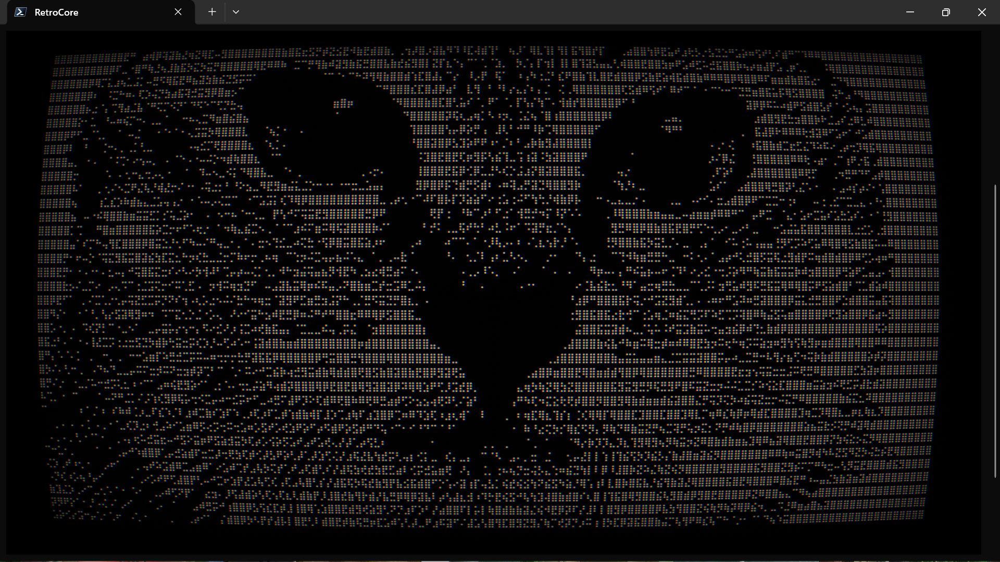
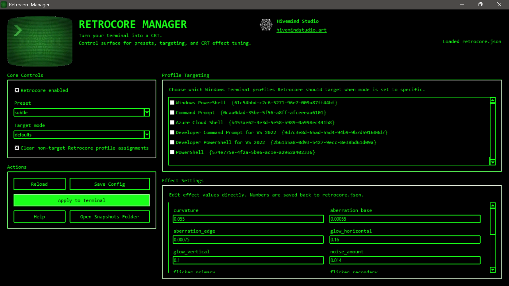
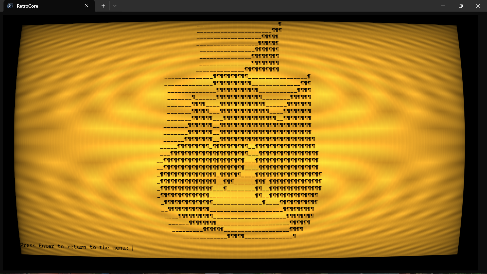
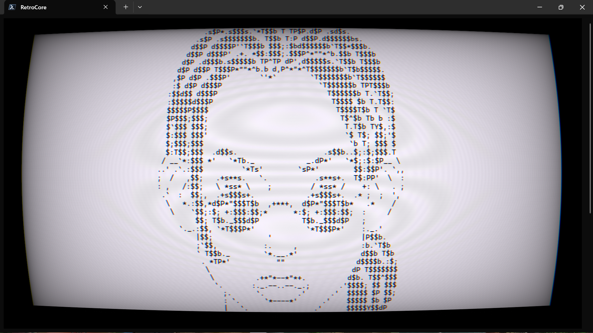
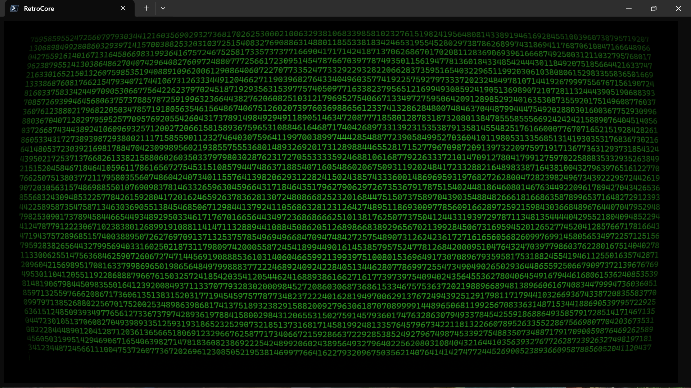
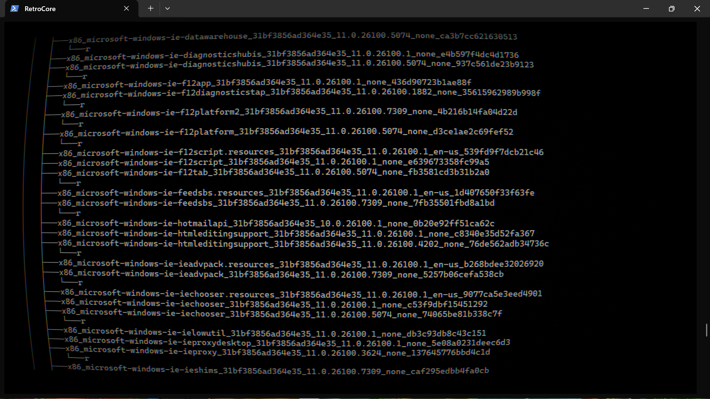

# retrocore

Retrocore is a Windows Terminal CRT shader manager with a CLI, presets, guided install scripts, and standalone Windows scripts for applying the shader without the CLI.

It keeps the shader project source in one folder, generates a managed shader file, and updates Windows Terminal settings so the effect can be turned on, turned off, or scoped to specific profiles.

## Gallery









## Status

Retrocore is currently being packaged as a `v0.1-alpha`.

Alpha means:

- the core CLI flow is usable now
- Windows Terminal settings are backed up before changes are written
- settings parsing tolerates common JSONC-style comments and trailing commas
- compatibility and UX are still being tightened before a broader release

## Features

- `retrocore on` and `retrocore off` aliases for quick toggling
- preset system with built-in and user-defined presets
- config editing through CLI commands instead of manual JSON edits
- Retrocore Manager UI for visual control of presets, targeting, and effect values
- profile targeting for specific terminals
- guided Windows install flow with optional Python bootstrapping
- standalone PowerShell and batch scripts for direct global apply/remove
- automatic settings backups in `snapshots/`

Preferred command style:

- use `retrocore on` and `retrocore off` as the main toggle verbs
- `enable` and `disable` still work, but are kept as compatibility aliases

## Quick start

From the project folder:

```powershell
.\retrocore.cmd status
.\retrocore.cmd preset list
.\retrocore.cmd on
.\retrocore.cmd manager
```

Quick verification:

```powershell
python .\tests\smoke_test.py
```

If you want a `retrocore` command available from any terminal:

```powershell
.\install_dependencies.ps1
```

Or:

```bat
install_dependencies.bat
```

## Common commands

```powershell
retrocore on
retrocore off
retrocore help
retrocore help preset use
retrocore preset list
retrocore preset use amber
retrocore preset save my-tube --description "My preferred everyday preset"
retrocore target only "PowerShell"
retrocore effect glow_horizontal 0.12
retrocore get target.mode
retrocore set target.clear_non_target_profiles false --no-apply
retrocore manager
```

## Standalone scripts

If you want a simple Windows-native path without the CLI:

- `apply_global.ps1` / `apply_global.bat`
- `remove_global.ps1` / `remove_global.bat`
- `manager.ps1` / `manager.bat`

These scripts copy the shader into Windows Terminal's `LocalState` folder and patch `settings.json` directly.

## Docs

- [Help](HELP.md)
- [Install Guide](docs/INSTALL.md)
- [CLI Reference](docs/CLI.md)
- [Standalone Scripts](docs/STANDALONE-SCRIPTS.md)
- [Alpha Launch Notes](ALPHA-LAUNCH.md)
- [v0.1 Alpha Release Notes](docs/RELEASE-NOTES-v0.1-alpha.md)

## License

MIT. See [LICENSE](LICENSE).

## Project layout

- `retrocore.py`: the CLI
- `manager.ps1` / `manager.bat`: direct Retrocore Manager launchers
- `retrocore.cmd`: local project wrapper
- `retrocore.json`: current project config
- `presets.json`: preset catalog
- `install_dependencies.ps1` / `install_dependencies.bat`: guided setup
- `apply_global.ps1` / `apply_global.bat`: standalone global apply
- `remove_global.ps1` / `remove_global.bat`: standalone global removal
- `shaders/retrocore.template.hlsl`: managed shader template
- `shaders/retrocore.generated.hlsl`: last generated local shader
- `snapshots/`: backups and imported reference files

## Notes

- Restart Windows Terminal after applying changes.
- The guided install creates a user-level command shim and points it at the current project folder.
- If you move the project folder later, rerun the installer.
- Built-in presets are protected and cannot be overwritten, renamed, or deleted.
- Writing back to Windows Terminal settings normalizes the file to standard JSON formatting.
